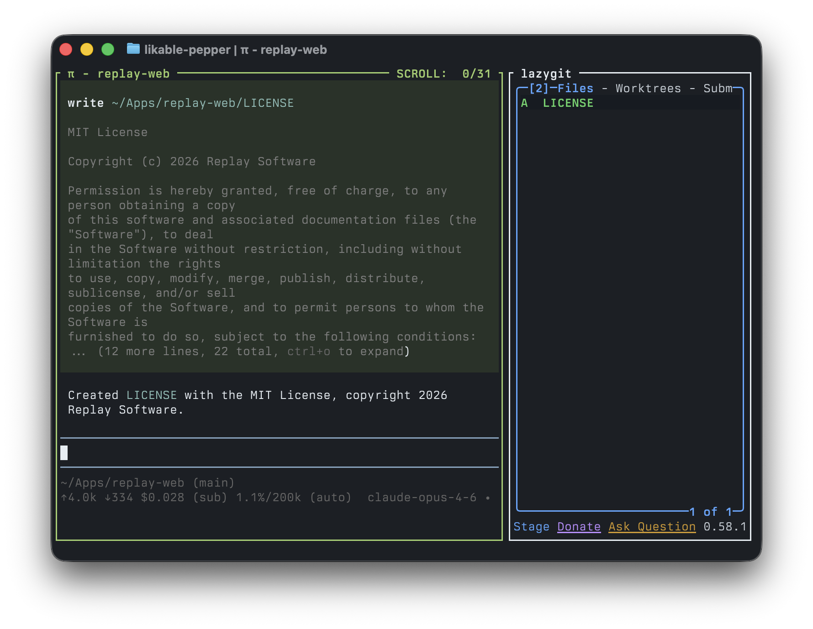

# sesh

A persistent split terminal session for AI-assisted coding. Runs an AI tool alongside lazygit in a single Zellij layout.

Sessions survive disconnects, so they're perfect for remote servers and coding across devices. Start a session on your laptop, close the lid, and pick it up from your phone or another machine. Pair it with a mobile SSH client like [Echo](https://replay.software/echo) for coding on the go.

## Install

### Fish

```fish
# With Fisher (recommended)
fisher install almonk/sesh

# Or manually
curl -sL https://raw.githubusercontent.com/almonk/sesh/main/functions/sesh.fish -o ~/.config/fish/functions/sesh.fish
curl -sL https://raw.githubusercontent.com/almonk/sesh/main/completions/sesh.fish -o ~/.config/fish/completions/sesh.fish
```

### Zsh

```zsh
curl -sL https://raw.githubusercontent.com/almonk/sesh/main/sesh.sh -o ~/.config/sesh.sh
echo 'source ~/.config/sesh.sh' >> ~/.zshrc
```

### Bash

```bash
curl -sL https://raw.githubusercontent.com/almonk/sesh/main/sesh.sh -o ~/.config/sesh.sh
echo 'source ~/.config/sesh.sh' >> ~/.bashrc
```

### Prompt

Paste this into your AI coding agent and it will handle the rest:

```
Install sesh from https://github.com/almonk/sesh — it's a shell function that launches a Zellij split with an AI coding tool and lazygit side by side. Detect my shell (fish, zsh, or bash) and install accordingly. Also install zellij and lazygit with brew if they're not already installed.
```

## Dependencies

Install with Homebrew:

```
brew install zellij lazygit
```

You'll also need at least one AI tool:

| Tool | Install |
|------|---------|
| [Claude Code](https://docs.anthropic.com/en/docs/claude-code) | `npm install -g @anthropic-ai/claude-code` |
| [Codex](https://github.com/openai/codex) | `npm install -g @openai/codex` |
| [Pi](https://github.com/badlogic/pi-mono/tree/main/packages/coding-agent) | `npm install -g @mariozechner/pi-coding-agent` |

## Usage

```
sesh                      # Claude + lazygit in current directory
sesh codex                # Codex + lazygit in current directory
sesh pi                   # Pi + lazygit in current directory
sesh claude ~/my-project  # Claude + lazygit in a specific directory
```

## Attaching to sessions

Each sesh session runs inside Zellij, which assigns it a random haiku-style name like `calm-river` or `silver-leaf`. If you close your terminal or detach, your session keeps running in the background.

List active sessions:

```
zellij list-sessions
```

Reattach to a session:

```
zellij attach calm-river
```

Kill a session:

```
zellij kill-session calm-river
```

## Keybindings

sesh includes built-in keybindings for switching between panes:

| Key | Action |
|-----|--------|
| `Alt+1` | Focus the AI pane (left) |
| `Alt+2` | Focus lazygit (right) |
| `Ctrl+q` | Detach from the session (keeps it running) |

These are embedded in the session layout and won't interfere with your global Zellij config. Use `Ctrl+q` to close the window — your session stays alive in the background and you can reattach later.

## Recommended lazygit config

Since lazygit runs in a narrow 35% pane, it looks best in single-column mode. Add this to your lazygit config (`~/Library/Application Support/lazygit/config.yml` on macOS, `~/.config/lazygit/config.yml` on Linux):

```yaml
gui:
  screenMode: full
  sidePanelWidth: 0.2
```

## How it works

sesh generates a temporary Zellij layout file and launches a session with two vertical panes:

- **Left (65%)** — your chosen AI tool (Claude Code by default)
- **Right (35%)** — lazygit for staging, committing, and managing git

The layout file is cleaned up automatically when the session ends.
